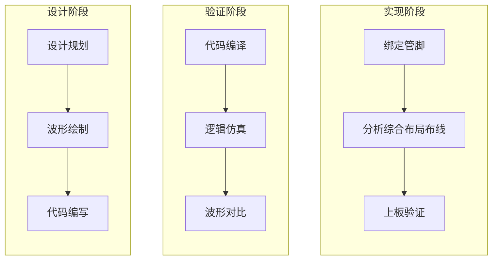

### Xilinx 7020

#### 1. 开发环境搭建

> [!TIP]
>
> :earth_asia: 


#### 2. 语法基础

> [!TIP]
>
> :star: `verilog`​实在`c`语言的基础上发展而来，很多语法特性相同；

##### 2.1 逻辑值

> [!important]
>
> :cat: 在实际电路中只会存在3种状态即`低电平（0）`、`高电平（1）`、`高阻态（z）`，而亚稳态即`x`只可能为`高电平`或者`低电平`状态中是不确定的状态；

| 逻辑值 |       含义       |
| :----: | :--------------: |
|   0    | 逻辑低，条件为假 |
|   1    | 逻辑高，条件为真 |
|   z    |  高阻态，无驱动  |
|   x    | 未知逻辑电平状态 |

##### 2.2 模块

> [!important]
>
> :cat: 注意`模块名称`要和`文件名称`对应；
>
> :cat: 注意所有模块的标点符号模块使用的是`小括号`；

```verilog
/* 此文件为 exmple.v */
/* 定义模块开始 */
module exmple (
	/* 内部定义输入或者输出或者输入输出信号类型 */
   	input wire sys_clk,	/* 创建一个输入时钟信号 */
    input wire sys_rst_n, /* 创建一个输入复位信号 */
    inout wire sda,	/* 创建 i2c 的数据信号为双向 */
	output wire scl	/* 创建 i2c 的时钟信号 */
);
endmodule /* 定义模块结束 */
```

##### 2.3 变量

> [!tip]
>
> :cat: ​`wire`类型会被映射成一个真实的物理连线；
>
> :cat: `reg`类型具有对某个时间点的状态进行保持的功能，会被映射成一个真实的物理存储器也就是寄存器；
>
> :cat: 注意输入信号一定是`wire`类型，而输出信号如果使用`always`语句进行赋值一定是`reg`类型；

```verilog
/* 线网型变量关键字 wire */
wire [0:0] flag;	/* 定义一条 flag 连线 */
/* 寄存器类型关键字 reg */
reg [7:0] cnt;		/* 定义一个八位的寄存器 */
```

##### 2.4 参数

> [!tip]
>
> :cat: `parameter`全局参数可以在实例化时进行修改；
>
> :cat: `localparam`局部参数只能在内部进行修改;

```verilog
/* 定义一个全局参数，类似c语言中的全局变量 */
parameter CNT_MAX = 100;

/* 定义一个局部参数，类似c语言中的局部变量 */
localparam CNT_MIN = 10;
```

##### 2.5 常数

> [!tip]
>
> :cat: 基本格式: [位宽]]+[']+[进制符号]+[要表示的数值]；
>
> :cat: 位宽如果不加`verilog`编译器会自动计算补上位宽声明；
>
> :cat: 如果位宽超出指定的数据的大小，未使用高位将自动`补0`，如果位宽小于指定的数据大小，超出的高位会被截断；

|     数据     |               含义                |
| :----------: | :-------------------------------: |
|    8'd171    |    位宽为`8bit`的十进制数`171`    |
|    8'hab     |  位宽为`8bit`的十六进制数`0xab`   |
|    8'o253    |    位宽为`8bit`的八进制数`253`    |
| 8'b1010_1011 | 位宽为`8bit`的二进制数`1010 1011` |

```verilog
/* 常数 */
a = 8'd171;
b = 16'habcd;
e = 16'b1010_1101_0001_1001;
```

##### 2.6 赋值

> [!tip]
>
> :cat: 阻塞赋值`=`：顺序执行赋值，同步赋值后面的需要等待前面赋值完毕；
>
> :cat: 非阻塞赋值`<=`：​并行执行赋值，异步赋值互不影响，同时执行；

```verilog
/* 阻塞赋值 = 顺序执行*/

/**
 * 最终执行结果：
 * para1: 2
 * para2: 2
 * para3: 2
 */
para1 = 1;
para2 = 2;
para3 = 3;

/**	
 * begin 和 end 是一对语句块的界定符，
 * 用于将多条语句组合成一个顺序块
 */
begin
   para1 = para2;
   para3 = para1;
end

```

```verilog
/* 非阻塞赋值 <= 同时执行 */

/**
 * 最终执行结果：
 * para1: 2
 * para2: 2
 * para3: 1
 */
para1 = 1;
para2 = 2;
para3 = 3;

/**	
 * begin 和 end 是一对语句块的界定符，
 * 用于将多条语句组合成一个顺序块
 */
begin
   para1 <= para2;
   para3 <= para1;
end
```

##### 2.7 运算符

> [!tip]
>
> :cat: `*`、`/`一般不会直接使用，会用`<<`和`>>`进行替代，因为乘除会占用大量资源；
>
> :cat: ​归约`&`会缩短长度为`1bit`，而`<<`和`>>`不会缩短`bit`数量；
>
> :cat: 运算符优先级：() > 归约运算符 > 算数运算符 > 移位运算符 > 关系运算符 > == 和 != > 按位运算符 > && 和 || > 条件运算符；
>
> :cat: 总体上看优先级为：一元运算符 > 二元运算符 > 三元运算符；​

###### 2.7.1 常规运算

|  运算符号   |         实现功能         |
| :---------: | :----------------------: |
|      +      |         两数相加         |
|      -      |         两数相减         |
|      *      |         两数相乘         |
|      /      |         两数相除         |
|      %      |    取模值（除法取整）    |
|  &（归约）  |  将某个数的所有位数相与  |
| &（逻辑与） |    两个数或者多个相与    |
|     ~&      |         与非运算         |
|      ^      |         异或运算         |
|     ~^      |        异或非运算        |
|     \|      |          或运算          |
|     ~\|     |         或非运算         |
|    \|\|     |     判断两数相或结果     |
|     &&      |     判断两数相与结果     |
|     ==      |     判断两数是否相等     |
|     !=      |     判断两数是否不等     |
|      <      |           小于           |
|      >      |           大于           |
|     >=      |         大于等于         |
|     <=      |         小于等于         |
|     <<      |    左移x位（a << x）     |
|     >>      |    右移x位（a >> x）     |
|    ？：     | 条件运算符（三元运算符） |
|    { , }    |       位拼接运算符       |

```verilog
/* 规约运算符，最终会缩小位数为 1 位 */
& 4'b1111 /* 1&1&1&1, 结果为 1'b1 */
& 4'b1001 /* 1&0&0&1, 结果为 1'b0 */

/* 普通与运算 */
4'b1011 & 4'b1101 /* 结果为 4'b1001 */

/* 移位运算 */
4'b1000 >> 3 /* 结果为 4'b0001 */
4'b1000 >> 4 /* 结果为 4'b0000 */

/* 条件运算符 */
a = 6;
b = 7;
/* 如果 a>b 为真则结果为 a 否则为 b */
c = (a > b) ？a : b; /* 结果为 c = 7 */

/* 位拼接：将几个长度较短量拼接成一个完整的数 */
a = 8'hab;		/* 定义一个 8 位的 a */
b = 3'b101;		/* 定义一个 3 位的 b */
c = 5'b10101;	/* 定义一个 5 位的 c */
wire [15:0] d;	/* 定义一个 16 位线网类型变量 d */
d = {a, b, c};	/* 位拼接运算为：0xabb5 */
```

###### 2.7.2 高级用法

* 使用`位拼接`运算符实现左右移位（移位器）：

```verilog
/**
 * din 为 1bit 的串行数据流，
 * 启始为1个时钟周期的高电平， 
 * 之后全都是低电平
 */
/* din: ____________|▔| */

/* 实现右移 */

/**
 * 实现过程：
 * c1: dout <= 4'b1000 ({1, 000})
 * c2: dout <= 4'b0100 ({0, 100})
 * c3: dout <= 4'b0010 ({0, 010})
 * c4: dout <= 4'b0001 ({0, 001})
 */

always@(posedge sys_clk or negedge sys_rst_n)
    if (1'b0 == sys_rst_n)			/* 如果复位则重新赋值 */
        dout <= 4'b0;
	else
        dout <= {din, dout[3:1]};	/* 如果不复位则移位 */ 

/* 实现左移 */

/**
 * 实现过程：
 * c1: dout <= 4'b0001 ({000, 1})
 * c2: dout <= 4'b0010 ({001, 0})
 * c3: dout <= 4'b0100 ({010, 0})
 * c4: dout <= 4'b1000 ({100, 0})
 */

always@(posedge sys_clk or negedge sys_rst_n)
    if (1'b0 == sys_rst_n)
        dout <= 4'b0;
	else
        dout <= {dout[2:0], din};

```

##### 2.8 分支控制

###### 2.8.1  if else类

> [!caution]
>
> :cat: 在使用`if else`的时候应尽量保证`else`的存在，如果`if`的条件不满足会退出不执行，但是这种写法在`always`块中表达组合逻辑时会产生锁存`latch`；
>
> :cat: 在`verilog`中允许分支嵌套，但是不建议使用，因为会导致逻辑状态混乱；

```verilog
/* 分支 */
if ()
    xxx;
else if ()
    xxx;
else
    xxx;
```

###### 2.8.2 case 类

> [!tip]
>
> :cat: `case`分支相比`if else`更加简洁优雅逻辑清晰；
>
> :cat: 分支的取值必须是不同的否则会自相矛盾；

```verilog
case (<控制表达式>)
    <分支语句1>: 语句块1;
    <分支语句2>: 语句块2;
    <分支语句3>: 语句块3;
    .......
    <分支语句n>: 语句块n;
    default: 语句块n+1;
endcase
    
```

##### 2.9 系统任务和系统函数

> [!tip]
>
> :cat: `Verilog`语言预置了一些任务和函数，用于完成一些特殊的功能，这些特殊功能只能在`Testbench`仿真中使用；
>
> :cat: 

TODO一部分内容，此部分关于调试函数相关，后面补充

#### 3. 点亮LED

> [!tip]
>
> :cat: 对整个流程的初步了解，不涉及具体代码的理解和实现过程讲解；
>
> :cat: 整体流程为：`设计阶段`-->`验证阶段`-->`实现阶段`；​

###### 3.1 FPGA开发流程引入



###### 3.2 实际操作

* 对于按键：用`PL_KEY1`作为模拟输入源，通过原理图分析可知当`SW5`按下后`PL_KEY1`为低电平，如果不按下则其被`3V3`上拉为高电平；


* 对于LED：当`PL_LED1`管脚输出高电平的时候发光二极管`LED4`发光；


* 使用`visio`工具画出逻辑时序图如下：


h

* 接下来编写`verilog`代码：

```verilog
/* 定义时间常数 */
/* 定义时间单位 1ns，时间精度为 1ps */
`timescale 1ns / 1ps

/* 设置模块 */
module led (
    /* 定义一个线网类型的输入信号 */
    input wire key_in,      /* 按键输入 */
    
    /* 定义一个线网类型的输出信号 */
    output wire led_out    /* led输出 */
);

/* 按键输入状态刚好和led的状态相反 */
assign led_out = ~key_in;

endmodule

```

* 编写仿真实例代码：

```verilog
/* 模块名称和文件名称对应 */
module tb_led();

/* 定义一个线网类型的变量 */
wire led_out;   /* 实际连线 */

/* 定义一个寄存器类型的变量 */
reg key_in;     /* 寄存按键输入状态，用于模拟实际硬件 */

/* 初始化输入信号, 仅仿真 */
initial key_in <= 1'b0;

/* 每 10ns 给 key_in 输入一个状态（和2取模后得到的余数要么 0 要么 1） */
always #10 key_in <= ({$random} % 2);

/* 实例化 */
/* 相当于 led_inst 为一个模块，将需要的信号线相连接*/
led led_inst (
    /*实例化中的 . 代表连接 */
    .key_in(key_in),
    .led_out(led_out)
);
```

* 上方的`verilog`代码使用`modelsim`的仿真波形如下，可以看见和我们预期的波形一致，所以实现过程没有问题；


* 约束管脚，设置使用的`io`和`电压域`：


* 下载bit流到FPGA上，注意断电后自动复原，此为烧录到FPGA的`SRAM`中；


* 实验结果，按下按键`led`成功点亮，松开按键`led`熄灭：


#### 4. 多路选通器

> [!tip]
>
> :cat: 原理是多个`in`信号通过`sel`切换哪一路的`in`最终到输出；


```verilog
/* initial 语句上电之后只执行一次 */
/* 块中多条语句的话 begin end 相当于大括号的意思 */
initial begin
    
end
```

