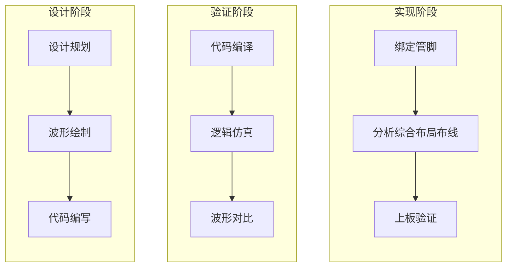

### Xilinx 7020

#### 1. 开发环境搭建

> [!TIP]
>
> :earth_asia: 


#### 2. 语法基础

> [!TIP]
>
> :star: `verilog`​实在`c`语言的基础上发展而来，很多语法特性相同；

##### 2.1 逻辑值

> [!important]
>
> :cat: 在实际电路中只会存在3种状态即`低电平（0）`、`高电平（1）`、`高阻态（z）`，而亚稳态即`x`只可能为`高电平`或者`低电平`状态中是不确定的状态；

| 逻辑值 |       含义       |
| :----: | :--------------: |
|   0    | 逻辑低，条件为假 |
|   1    | 逻辑高，条件为真 |
|   z    |  高阻态，无驱动  |
|   x    | 未知逻辑电平状态 |

##### 2.2 模块

> [!important]
>
> :cat: 注意`模块名称`要和`文件名称`对应；
>
> :cat: 注意所有模块的标点符号模块使用的是`小括号`；

```verilog
/* 此文件为 exmple.v */
/* 定义模块开始 */
module exmple (
	/* 内部定义输入或者输出或者输入输出信号类型 */
   	input wire sys_clk,	/* 创建一个输入时钟信号 */
    input wire sys_rst_n, /* 创建一个输入复位信号 */
    inout wire sda,	/* 创建 i2c 的数据信号为双向 */
	output wire scl	/* 创建 i2c 的时钟信号 */
);
endmodule /* 定义模块结束 */
```

##### 2.3 变量

> [!tip]
>
> :cat: ​`wire`类型会被映射成一个真实的物理连线；
>
> :cat: `reg`类型具有对某个时间点的状态进行保持的功能，会被映射成一个真实的物理存储器也就是寄存器；
>
> :cat: 注意输入信号一定是`wire`类型，而输出信号如果使用`always`语句进行赋值一定是`reg`类型；

```verilog
/* 线网型变量关键字 wire */
wire [0:0] flag;	/* 定义一条 flag 连线 */
/* 寄存器类型关键字 reg */
reg [7:0] cnt;		/* 定义一个八位的寄存器 */
```

##### 2.4 参数

> [!tip]
>
> :cat: `parameter`全局参数可以在实例化时进行修改；
>
> :cat: `localparam`局部参数只能在内部进行修改;

```verilog
/* 定义一个全局参数，类似c语言中的全局变量 */
parameter CNT_MAX = 100;

/* 定义一个局部参数，类似c语言中的局部变量 */
localparam CNT_MIN = 10;
```

##### 2.5 常数

> [!tip]
>
> :cat: 基本格式: [位宽]]+[']+[进制符号]+[要表示的数值]；
>
> :cat: 位宽如果不加`verilog`编译器会自动计算补上位宽声明；
>
> :cat: 如果位宽超出指定的数据的大小，未使用高位将自动`补0`，如果位宽小于指定的数据大小，超出的高位会被截断；

|     数据     |               含义                |
| :----------: | :-------------------------------: |
|    8'd171    |    位宽为`8bit`的十进制数`171`    |
|    8'hab     |  位宽为`8bit`的十六进制数`0xab`   |
|    8'o253    |    位宽为`8bit`的八进制数`253`    |
| 8'b1010_1011 | 位宽为`8bit`的二进制数`1010 1011` |

```verilog
/* 常数 */
a = 8'd171;
b = 16'habcd;
e = 16'b1010_1101_0001_1001;
```

##### 2.6 赋值

> [!tip]
>
> :cat: 阻塞赋值`=`：顺序执行赋值，同步赋值后面的需要等待前面赋值完毕；
>
> :cat: 非阻塞赋值`<=`：​并行执行赋值，异步赋值互不影响，同时执行；

```verilog
/* 阻塞赋值 = 顺序执行*/

/**
 * 最终执行结果：
 * para1: 2
 * para2: 2
 * para3: 2
 */
para1 = 1;
para2 = 2;
para3 = 3;

/**	
 * begin 和 end 是一对语句块的界定符，
 * 用于将多条语句组合成一个顺序块
 */
begin
   para1 = para2;
   para3 = para1;
end

```

```verilog
/* 非阻塞赋值 <= 同时执行 */

/**
 * 最终执行结果：
 * para1: 2
 * para2: 2
 * para3: 1
 */
para1 = 1;
para2 = 2;
para3 = 3;

/**	
 * begin 和 end 是一对语句块的界定符，
 * 用于将多条语句组合成一个顺序块
 */
begin
   para1 <= para2;
   para3 <= para1;
end
```

##### 2.7 运算符

> [!tip]
>
> :cat: `*`、`/`一般不会直接使用，会用`<<`和`>>`进行替代，因为乘除会占用大量资源；
>
> :cat: ​归约`&`会缩短长度为`1bit`，而`<<`和`>>`不会缩短`bit`数量；
>
> :cat: 运算符优先级：() > 归约运算符 > 算数运算符 > 移位运算符 > 关系运算符 > == 和 != > 按位运算符 > && 和 || > 条件运算符；
>
> :cat: 总体上看优先级为：一元运算符 > 二元运算符 > 三元运算符；​

###### 2.7.1 常规运算

|  运算符号   |         实现功能         |
| :---------: | :----------------------: |
|      +      |         两数相加         |
|      -      |         两数相减         |
|      *      |         两数相乘         |
|      /      |         两数相除         |
|      %      |    取模值（除法取整）    |
|  &（归约）  |  将某个数的所有位数相与  |
| &（逻辑与） |    两个数或者多个相与    |
|     ~&      |         与非运算         |
|      ^      |         异或运算         |
|     ~^      |        异或非运算        |
|     \|      |          或运算          |
|     ~\|     |         或非运算         |
|    \|\|     |     判断两数相或结果     |
|     &&      |     判断两数相与结果     |
|     ==      |     判断两数是否相等     |
|     !=      |     判断两数是否不等     |
|      <      |           小于           |
|      >      |           大于           |
|     >=      |         大于等于         |
|     <=      |         小于等于         |
|     <<      |    左移x位（a << x）     |
|     >>      |    右移x位（a >> x）     |
|    ？：     | 条件运算符（三元运算符） |
|    { , }    |       位拼接运算符       |

```verilog
/* 规约运算符，最终会缩小位数为 1 位 */
& 4'b1111 /* 1&1&1&1, 结果为 1'b1 */
& 4'b1001 /* 1&0&0&1, 结果为 1'b0 */

/* 普通与运算 */
4'b1011 & 4'b1101 /* 结果为 4'b1001 */

/* 移位运算 */
4'b1000 >> 3 /* 结果为 4'b0001 */
4'b1000 >> 4 /* 结果为 4'b0000 */

/* 条件运算符 */
a = 6;
b = 7;
/* 如果 a>b 为真则结果为 a 否则为 b */
c = (a > b) ？a : b; /* 结果为 c = 7 */

/* 位拼接：将几个长度较短量拼接成一个完整的数 */
a = 8'hab;		/* 定义一个 8 位的 a */
b = 3'b101;		/* 定义一个 3 位的 b */
c = 5'b10101;	/* 定义一个 5 位的 c */
wire [15:0] d;	/* 定义一个 16 位线网类型变量 d */
d = {a, b, c};	/* 位拼接运算为：0xabb5 */
```

###### 2.7.2 高级用法

* 使用`位拼接`运算符实现左右移位（移位器）：

```verilog
/**
 * din 为 1bit 的串行数据流，
 * 启始为1个时钟周期的高电平， 
 * 之后全都是低电平
 */
/* din: ____________|▔| */

/* 实现右移 */

/**
 * 实现过程：
 * c1: dout <= 4'b1000 ({1, 000})
 * c2: dout <= 4'b0100 ({0, 100})
 * c3: dout <= 4'b0010 ({0, 010})
 * c4: dout <= 4'b0001 ({0, 001})
 */

always@(posedge sys_clk or negedge sys_rst_n)
    if (1'b0 == sys_rst_n)			/* 如果复位则重新赋值 */
        dout <= 4'b0;
	else
        dout <= {din, dout[3:1]};	/* 如果不复位则移位 */ 

/* 实现左移 */

/**
 * 实现过程：
 * c1: dout <= 4'b0001 ({000, 1})
 * c2: dout <= 4'b0010 ({001, 0})
 * c3: dout <= 4'b0100 ({010, 0})
 * c4: dout <= 4'b1000 ({100, 0})
 */

always@(posedge sys_clk or negedge sys_rst_n)
    if (1'b0 == sys_rst_n)
        dout <= 4'b0;
	else
        dout <= {dout[2:0], din};

```

##### 2.8 分支控制

###### 2.8.1  if else类

> [!caution]
>
> :cat: 在使用`if else`的时候应尽量保证`else`的存在，如果`if`的条件不满足会退出不执行，但是这种写法在`always`块中表达组合逻辑时会产生锁存`latch`；
>
> :cat: 在`verilog`中允许分支嵌套，但是不建议使用，因为会导致逻辑状态混乱；

```verilog
/* 分支 */
if ()
    xxx;
else if ()
    xxx;
else
    xxx;
```

###### 2.8.2 case 类

> [!tip]
>
> :cat: `case`分支相比`if else`更加简洁优雅逻辑清晰；
>
> :cat: 分支的取值必须是不同的否则会自相矛盾；

```verilog
case (<控制表达式>)
    <分支语句1>: 语句块1;
    <分支语句2>: 语句块2;
    <分支语句3>: 语句块3;
    .......
    <分支语句n>: 语句块n;
    default: 语句块n+1;
endcase
    
```

##### 2.9 系统任务和系统函数

> [!tip]
>
> :cat: `Verilog`语言预置了一些任务和函数，用于完成一些特殊的功能，这些特殊功能只能在`Testbench`仿真中使用；
>
> :cat: 

TODO一部分内容，此部分关于调试函数相关，后面补充

#### 3. 点亮LED

> [!tip]
>
> :cat: 对整个流程的初步了解，不涉及具体代码的理解和实现过程讲解；
>
> :cat: 整体流程为：`设计阶段`-->`验证阶段`-->`实现阶段`；​

###### 3.1 FPGA开发流程引入



###### 3.2 实际操作

* 对于按键：用`PL_KEY1`作为模拟输入源，通过原理图分析可知当`SW5`按下后`PL_KEY1`为低电平，如果不按下则其被`3V3`上拉为高电平；


* 对于LED：当`PL_LED1`管脚输出高电平的时候发光二极管`LED4`发光；


* 使用`visio`工具画出逻辑时序图如下：


h

* 接下来编写`verilog`代码：

```verilog
/* 定义时间常数 */
/* 定义时间单位 1ns，时间精度为 1ps */
`timescale 1ns / 1ps

/* 设置模块 */
module led (
    /* 定义一个线网类型的输入信号 */
    input wire key_in,      /* 按键输入 */
    
    /* 定义一个线网类型的输出信号 */
    output wire led_out    /* led输出 */
);

/* 按键输入状态刚好和led的状态相反 */
assign led_out = ~key_in;

endmodule

```

* 编写仿真实例代码：

```verilog
/* 模块名称和文件名称对应 */
module tb_led();

/* 定义一个线网类型的变量 */
wire led_out;   /* 实际连线 */

/* 定义一个寄存器类型的变量 */
reg key_in;     /* 寄存按键输入状态，用于模拟实际硬件 */

/* 初始化输入信号, 仅仿真 */
initial key_in <= 1'b0;

/* 每 10ns 给 key_in 输入一个状态（和2取模后得到的余数要么 0 要么 1） */
always #10 key_in <= ({$random} % 2);

/* 实例化 */
/* 相当于 led_inst 为一个模块，将需要的信号线相连接*/
led led_inst (
    /*实例化中的 . 代表连接 */
    .key_in(key_in),
    .led_out(led_out)
);
```

* 上方的`verilog`代码使用`modelsim`的仿真波形如下，可以看见和我们预期的波形一致，所以实现过程没有问题；


* 约束管脚，设置使用的`io`和`电压域`：


* 下载bit流到FPGA上，注意断电后自动复原，此为烧录到FPGA的`SRAM`中；


* 实验结果，按下按键`led`成功点亮，松开按键`led`熄灭：


#### 4. 多路选通器

> [!tip]
>
> :cat: 原理是多个`in`信号通过`sel`切换哪一路的`in`最终到输出；


```verilog
/* 设置时间常数 单位: 1ns 精度: 1ns */
`timescale 1ns/1ns

/* 创建 module */
module mux2_1 (
    /* 线网类型输入信号 in1 */
    input wire [0:0] in1,
    /* 线网类型输入信号 in2 */
    input wire [0:0] in2,
    /* 线网类型输入选择信号 sel */
    input wire [0:0] sel,
    /* 最终输出信号 */
    /* 注意这里如果使用always语句进行赋值必须是reg类型 */
    output wire [0:0] out
);
    
/* sel高电平选择in1，sel低电平选择in2 */
    
/* 使用always语句不断检测sel状态，有变化的时候就执行判断 */
always@(sel)
    begin
    if (1'b0 == sel)
        out = in2;
    else 
        out = in1;
    end
    
/* 使用case语句实现 */
always@(sel)
    begin
    case (sel)
        1'b1: out = in1;
        1'b0: out = in2;
        default: out = in1;
    endcase
    end
    
/* 使用连续赋值函数 assign */
assign out = (1'b1 == sel) ? in1 : in2;
    
endmodule
```

```verilog
/* 仿真 RTL 代码 */
`timescale 1ns / 1ns

module tb_mux();

reg [0:0] in1;
reg [0:0] in2;
reg [0:0] sel;

/* 仿真中输出信号是wire型 */  
wire [0:0] out;

/* 赋予初始值，initial 只会执行一次 */
initial begin
    in1 <= 1'b0;
    in2 <= 1'b0;
    sel <= 1'b1;
end

/* 产生随机输入源 */
always #10 in1 <= {$random} % 2;
always #10 in2 <= {$random} % 2;
always #10 sel <= {$random} % 5;

/* 添加检测函数 */

initial begin
    /**
     * -9: 10^-9，表示ns
     * 0: 表示小数点后面打印0位小数
     * "ns": 单位 ns 必须和前面设定的一致
     * 6: 打印的最小数量字符为6个
     */
    $timeformat(-9, 0, "ns", 6);

    $monitor("=== time: %t in1: %b in2: %b sel: %b out: %b ===", 				
             $time, in1, in2, sel, out);

end

/* 实例化 */
mux mux_tb(
    .in1(in1),
    .in2(in2),
    .sel(sel),
    .out(out)
);

endmodule
```

#### 5. 译码器


```verilog
`timescale 1ns / 1ns

/**
 *  in3     in2     in1         out 
 *   0       0       0       0000_0001b
 *   0       0       1       0000_0010b
 *   0       1       0       0000_0100b
 *   0       1       1       0000_1000b
 *   1       0       0       0001_0000b
 *   1       0       1       0010_0000b
 *   1       1       0       0100_0000b
 *   1       1       1       1000_0000b
 */

module decoder(
    input wire [0:0] in1,
    input wire [0:0] in2,
    input wire [0:0] in3,
    /* 使用always语句进行赋值必须使用reg类型变量 */
    output reg [7:0] out
);

always@(*) begin
    case ({in3, in2, in1})
    3'b000: out = 8'h01;
    3'b001: out = 8'h02;
    3'b010: out = 8'h04;
    3'b011: out = 8'h08;
    3'b100: out = 8'h10;
    3'b101: out = 8'h20;
    3'b110: out = 8'h40;
    3'b111: out = 8'h80;
    default: out = 8'h00;
    endcase
end

endmodule

```

```verilog
`timescale 1ns / 1ns

module tb_decoder();

reg [0:0] in1;
reg [0:0] in2;
reg [0:0] in3;

wire [7:0] out;

initial begin
    in1 <= 1'b0;
    in2 <= 1'b0;
    in3 <= 1'b0;
end

initial begin
    $timeformat(-9, 0, "ns", 6);

    $monitor("=== time: %t in1: %b in2: %b in3: %b out: %b ===", 
        $time, in1, in2, in3, out);
end

/* 非阻塞赋值 */
always #10 in1 = {$random} % 2;
always #10 in2 = {$random} % 2;
always #10 in3 = {$random} % 2;

/* 实例化 */
decoder sss(
    .in1(in1),
    .in2(in2),
    .in3(in3),
    .out(out)
);

endmodule
```

#### 6. 半加器

* 半加器原理和真值图


* 仿真和模块代码实现：

```verilog
/* 模块代码 */
`timescale 1ns / 1ps

module half(
    input wire [0:0] in1,
    input wire [0:0] in2,
    /* 这里使用 assign 进行赋值，所以要使用线网类型 */
    output wire [0:0] sum,
    output wire [0:0] count
);

assign {count, sum} = in1 + in2;

endmodule
```

```verilog
/* 仿真代码 */
`timescale 1ns / 1ps

module tb_half (
    
);

reg [0:0] in1;
reg [0:0] in2;
wire [0:0] sum;
wire [0:0] count;

always #10 in1 = {$random} % 2;
always #10 in2 = {$random} % 5;

initial begin
    $timeformat(-9, 0, "ns", 6);
    $monitor("=== time: %t in1: %b in2: %b sum:%b count: %b ===",
                $time, in1, in2, sum, count);
end

/* 实例化 half */
half half_inst (
    .in1(in1),
    .in2(in2),
    .sum(sum),
    .count(count)
);  

endmodule
```

#### 7. 分层设计的概念

>[!tip]
>
>:cat: 数字电路中根据模块层次的不同有两种基本的结构设计方法：自底向上`Bottom-Up`的设计法和自顶向下`Top-Down`的设计方法；
>
>:cat: 之所以进行分层就和高级语言中编写功能模块最后在逻辑代码中调用，主要目的是易于维护管理，以及后续复用；
>
>:cat: 以全加器为例子调用半加器的实现组合成全加器；


* 全加器用双半加器拼接组合示例图如下：


* 全加器真值表：

|  IN1   |  IN2   |  INC   |  CNT   |  SUM   |
| :----: | :----: | :----: | :----: | :----: |
|   0    |   0    |   0    |   0    |   0    |
|   1    |   0    |   0    |   0    |   1    |
|   0    |   1    |   0    |   0    |   1    |
|   1    |   1    |   0    |   1    |   1    |
|   1    |   1    |   1    |   1    |   0    |
| ...... | ...... | ...... | ...... | ...... |

* 代码实现和仿真

```verilog
/* top.v 顶层设计 */
`timescale 1ns / 1ps

module top(
    input wire [0:0] f_in1,
    input wire [0:0] f_in2,
    input wire [0:0] f_inc,
    output wire [0:0] f_cnt,
    output wire [0:0] f_sum
);

wire [0:0] half_adder0_res;
wire [0:0] cnt0;
wire [0:0] cnt1;

/* 实例化半加器1 */
full full_inst1 (
    .in1(f_in1),
    .in2(f_in2),
    .cnt(cnt0),
    .sum(half_adder0_res)
);

/* 实例化半加器2 */
full full_inst2 (
    .in1(half_adder0_res),
    .in2(f_inc),
    .cnt(cnt1),
    .sum(f_sum)
);

assign f_cnt = (cnt0 | cnt1);

endmodule

```

```shell
/* half_adder.v */
/* 半加器 */
`timescale 1ns / 1ps

module full(
    input wire [0:0] in1,
    input wire [0:0] in2,
    output wire [0:0] cnt,
    output wire [0:0] sum
);

assign {cnt, sum} = in1 + in2;

endmodule

```

```verilog
/* tb_full.v */
/* 仿真激励 */
`timescale 1ns / 1ps

module tb_full();

reg [0:0] tb_in1;
reg [0:0] tb_in2;
reg [0:0] tb_in3;

wire [0:0] tb_cnt;
wire [0:0] tb_sum;

always #10 tb_in1 = {$random} % 2;
always #10 tb_in2 = {$random} % 4;
always #10 tb_in3 = {$random} % 5;

top top_inst(
    .f_in1(tb_in1),
    .f_in2(tb_in2),
    .f_inc(tb_in3),
    .f_cnt(tb_cnt),
    .f_sum(tb_sum)
);

endmodule
```

#### 8. 如何避免产生latch

>[!tip]
>
>:cat: `latch`就是锁存器，在异步电路中对输入信号电平敏感的单元，用来存储信息，锁存器在数据未锁存的时候，输出端信号随输入信号的变化而变化，一旦锁存信号有效输入信号不管怎么变化都不会影响输出信号；
>
>:cat: ​`异步电路`：异步电路主要是组合逻辑电路，用来产生`FIFO`或者`ROM`读写控制信号脉冲；但它也同时用在时序电路中，但是在时序电路中没有统一的时钟，状态的变化是不稳定的，通常输入信号只在电路处于稳定状态时才变化；
>
>:cat: ​`同步电路`：同步电路是由时序电路（寄存器和各种触发器）和组合逻辑电路构成的电路，其所有的操作都是在严格的时钟控制下完成的。这些时序电路共享同一个`CLK`，而所有的状态变化都是在时钟的上升沿（或下降沿）完成；

> [!caution]
>
> :cat: 当组合逻辑中`if-else`条件分支语句中缺少`else`时会产生`latch`；
>
> :cat: 当组合逻辑中`case`条件分支语句缺少`default`语句时会产生`latch`；
>
> :cat: 当组合逻辑中输出变量赋值给自己的时候会产生`latch`；

> [!caution]
>
> :cat: `latch`的危害有如下：
>
> * 对毛刺敏感；
> * 不能异步复位；
> * 复杂的静态时序分析；
> * 占用更多逻辑资源；
> * 额外的延时；

#### 9. 寄存器

> [!tip]
>
> :cat: 寄存器具有存储功能，一般是有`D触发器`构成，由时钟脉冲控制，每个`D触发器`能存储一位的二进制值；寄存器拥有复位清零的功能，其复位又分为同步复位和异步复位；
>
> :cat: `D触发器`的工作原理：在一个脉冲信号（一般为晶振产生的时钟脉冲）上升沿或者下降沿的作用下，将信号从`输入端D`送到`输出端Q`，如果时钟的边沿信号未出现，即使输入信号改变，输出信号仍然保持原值；
>
> :cat: `D触发器`的同步或者异步复位的区别：`同步复位`检测到复位信号之后会等到下一个高电平的时候才会复位，而`异步复位`当复位信号到来的那一刻直接复位；

* 下图假设输入信号一直为高电平，只有复位信号能改变输出信号也就是是`led_out`的状态，具体`同步复位`和`异步复位`的区别如下：


* `组合逻辑`和`时序逻辑`对毛刺现象的实际作用效果对比：


* `时序逻辑`会产生延时`一拍`的效果，其原因是当输入信号和时钟边沿相齐的时候时序逻辑会采样边沿的前一时刻的值作为输出值，如下图所示假设`key_in`为输入信号：


* `时序逻辑`同步和异步复位时序图以及`verilog`代码实现：


* 模块实现代码：

```verilog
/* 模块实现 */
/* 输入信号是wire类型，输出信号要看使用什么进行赋值 */
/* assign 赋值的话要定义wire类型，always进行赋值的话要定义reg类型 */
/* 时序电路涉及到时钟一定要用非阻塞赋值 */
`timescale 1ns / 1ps

module register(
    /* 输入均为线网类型变量 */
    input wire [0:0] sys_rst_n,
    /* 50Mhz 系统时钟输入 */
    input wire [0:0] sys_clk,
    input wire [0:0] key_in,
    /* 输出使用always语句进行赋值，所以定义reg类型 */
    output reg [0:0] led_out
);

/** 
 *  negedge: 下降沿
 *  posedge: 上升沿
 */

/* 同步复位 */
/* 也就是说同步复位有时间要求，如果复位时间极短无法达到复位需求 */
always@(posedge sys_clk) begin
    /* 当时钟是上升沿且复位信号有效 */
    if (1'b0 == sys_rst_n)
        led_out <= 1'b0;
    else 
        led_out <= key_in;
end

/* 异步复位 */
/* 无复位时间要求，检测到即进行复位，易出现误判情形 */
always@(negedge sys_rst_n or posedge sys_clk) begin
    /* 如果检测到 sys_rst_n 的下降沿或者 sys_clk 上升沿就执行判断 */
    /* 这里复位信号低电平有效 */
    if (1'b0 == sys_rst_n)
        led_out <= 1'b0;
    else
        led_out <= key_in;
end

endmodule

```

```verilog
/* 仿真激励 */
`timescale 1ns / 1ps
/* 阻塞赋值和非阻塞赋值未清晰明确，下节会讲解 */
module tb_reg();

/* 模拟系统时钟激励 */
reg [0:0] tb_sys_clk;
/* 模拟系统复位激励 */
reg [0:0] tb_sys_rst;
/* 模拟按键输入激励 */
reg [0:0] tb_key_in;
/* 定义线网类型将输出信号引出 */
wire [0:0] tb_led_out;

/* 初始化输入激励状态 */
initial begin
    tb_sys_clk = 1'b1;
    tb_key_in <= 1'b0;
    tb_sys_rst <= 1'b0;
    #20
    tb_sys_rst <= 1'b1;
    #210
    tb_sys_rst <= 1'b0;
    #40
    tb_sys_rst <= 1'b1;
end

/**
 * 模拟产生50Mhz的系统时钟 
 *  ____|▔▔|____|▔▔|____
 * |10ns|10ns|10ns|10ns|10ns|
 */

always #10 tb_sys_clk = ~tb_sys_clk;

/* 模拟随机的按键输出激励 */
always #20 tb_key_in <= {$random} % 2;

/* 实例化 */
register tb_reg (
    .sys_rst_n(tb_sys_rst),
    .sys_clk(tb_sys_clk),
    .key_in(tb_key_in),
    .led_out(tb_led_out)
);

endmodule
```

* `时序电路`同步复位仿真结果：


* `时序电路`异步复位仿真结果：


#### 10. 阻塞赋值和非阻塞赋值

> [!important]
>
> :cat: `阻塞赋值（=）`：电路结构和触发沿`没有`关系，只和输入电平的变化有关；它的操作可以认为是只有一个步骤的操作：计算`=`右边的结果并更新`=`左边的语句值，且在这个过程中不允许其它语句的干扰，直到赋值结束才会进行下一次赋值；
>
> :cat: `非阻塞赋值（<=）`：电路结构和触发沿`有`关系，只有在触发沿的时刻才能进行阻塞赋值；在赋值开始时刻计算`<=`右边的语句值，赋值结束时刻更新`<=`左边的语句值（这个过程为两次相同的时钟边沿）且此过程允许其它的赋值语句并行执行；

> [!caution]
>
> :cat: `非阻塞`操作只能用于对寄存器类型的变量进行赋值，因此只能用于`initial`和`always`块中，不可用在`assign`连续赋值语句块中；
>
> :cat: 在编写`时序逻辑`的时候推荐使用`非阻塞赋值`的方式；使用`always`语句块编写`组合逻辑`的时候使用`阻塞赋值`的方式进行赋值，且`敏感列表`要使用电平触发的方式；
>
> :cat: 在一个`always`语句块中不能即使用`阻塞赋值`又使用`非阻塞赋值`，否则会造成时序逻辑混乱；
>
> :cat: 如果一定要使用`锁存器latch`的时候一定要使用`非阻塞赋值`的方式进行赋值；
>
> :cat: 推荐一个`always`语句块中只对一个变量进行赋值，这样方便后期维护修改；

